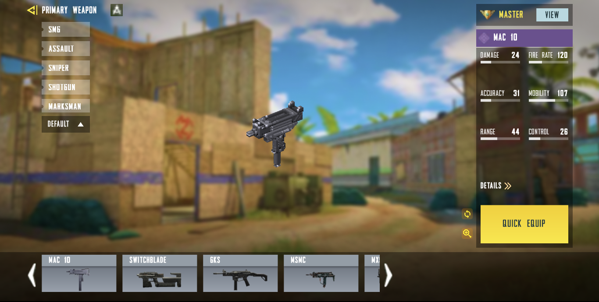

# Call of Duty Mobile Loadout UI 🎮

Welcome to the **Call of Duty Mobile Loadout UI** project. This repository showcases a sleek and interactive UI inspired by the popular game Call of Duty Mobile. Dive into the immersive experience of CODM loadouts with this Flutter-based UI.



🎥 **Demo Video**:
[](https://user-images.githubusercontent.com/104990430/197424703-6d029d9f-5a9e-4735-8687-88cef572f05a.mp4)

---

## 🌟 **Features**

- 🎨 **Sleek Design**: A modern and intuitive design inspired by CODM.
- 📱 **Responsive**: Optimized for both mobile and tablet devices.
- 🚀 **Performance**: Smooth animations and transitions for a seamless experience.
- 🛠 **Customizable**: Easily adaptable codebase for further enhancements.

---

## 🚀 **Getting Started**

### **Prerequisites**
- Flutter SDK

### **Installation Steps**
1. **Clone the Repository**:
   ```bash
   git clone https://github.com/prateekp273/Call_of_duty_UI.git
